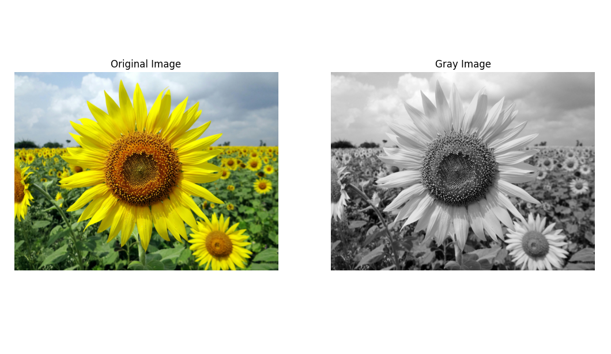
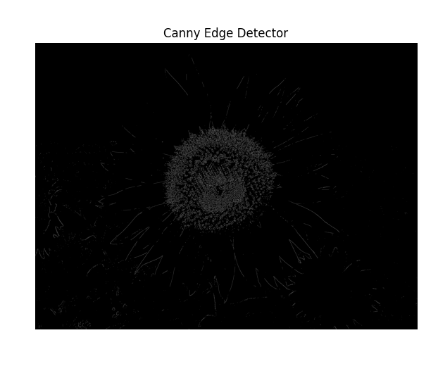
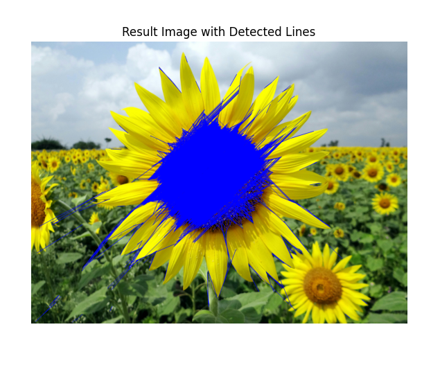

# Edge-Linking-using-Hough-Transformm
## Aim:
To write a Python program to detect the lines using Hough Transform.

## Software Required:
Anaconda - Python 3.7

## Algorithm:
### Step1:

Import all the necessary modules for the program.
### Step2:

Load a image using imread() from cv2 module.
### Step3:

Convert the image to grayscale.
### Step4:

Using Canny operator from cv2,detect the edges of the image.
### Step5:

Using the HoughLinesP(),detect line co-ordinates for every points in the images.Using For loop,draw the lines on the found co-ordinates. Display the image.

## Code
```md
Name    : Sam Israel D
Reg. No : 212222230128
```
```python
import numpy as np
import cv2
import matplotlib.pyplot as plt

# Read the color image using imread
img_c = cv2.imread('/home/sam/PycharmProjects/pythonProject1/color.jpg')  

# Convert the color from BGR to RGB
img_rgb = cv2.cvtColor(img_c, cv2.COLOR_BGR2RGB)

# Convert the color image to grayscale
gray = cv2.cvtColor(img_c, cv2.COLOR_BGR2GRAY)

# Apply Gaussian blur to the grayscale image
gray = cv2.GaussianBlur(gray, (3, 3), 0)

# Display original and grayscale images
plt.figure(figsize=(13, 13))
plt.subplot(1, 2, 1)
plt.imshow(img_rgb)
plt.title("Original Image")
plt.axis("off")
plt.subplot(1, 2, 2)
plt.imshow(gray, cmap='gray')
plt.title("Gray Image")
plt.axis("off")
plt.show()

# Apply Canny edge detector
canny = cv2.Canny(gray, 120, 150)

# Display the Canny edge image
plt.figure(figsize=(7, 7))
plt.imshow(canny, cmap='gray')
plt.title("Canny Edge Detector")
plt.axis("off")
plt.show()

# Detect lines using Hough Transform
lines = cv2.HoughLinesP(canny, 1, np.pi / 180, threshold=80, minLineLength=50, maxLineGap=250)

# Draw lines on the original image
if lines is not None:
    for line in lines:
        x1, y1, x2, y2 = line[0]
        cv2.line(img_c, (x1, y1), (x2, y2), (255, 0, 0), 3)

# Display the result image with detected lines
plt.figure(figsize=(7, 7))
plt.imshow(cv2.cvtColor(img_c, cv2.COLOR_BGR2RGB))
plt.title("Result Image with Detected Lines")
plt.axis("off")
plt.show()

```
## Output

### Input image and grayscale image


### Canny Edge detector output


### Display the result of Hough transform


## Result

Thus, a Python program to detect the lines using Hough Transform is implemented successfully.